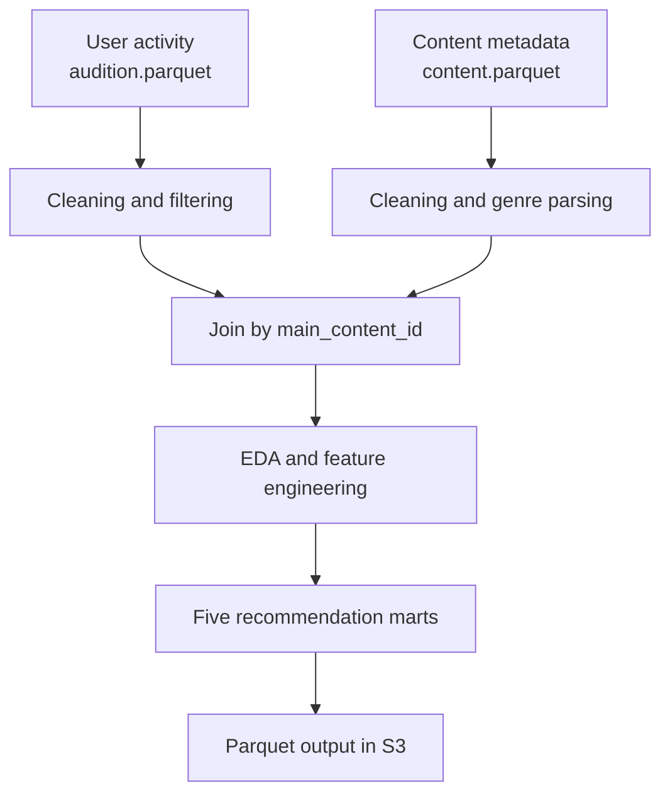

# PySpark ETL Pipeline for Recommendation Marts


An ETL pipeline built with PySpark that processes user reading and listening activity, enriches it with content metadata, performs data-quality checks and exploratory analysis, and produces five feature marts for a recommendation system.

The project was completed as part of the Data Science course at Yandex Practicum.

## Project Goal

A recommendation system needs features at different levels of granularity. A single universal table would be too large and inconvenient for ranking models, user profiling, content analysis, and activity monitoring.

This pipeline creates five specialized marts:

| Mart | Granularity | Purpose |
|---|---|---|
| `user_content_mart` | User — content item | User interaction history, implicit feedback and completion features |
| `user_genre_mart` | User — genre | User interests, genre profiles and cold-start recommendations |
| `user_mart` | User | User-level features, segmentation and preference profiles |
| `content_mart` | Content item | Popularity, audience size and content-quality features |
| `daily_user_mart` | User — date | Daily activity and temporal behavior patterns |

## Pipeline



The pipeline performs the following operations:

1. Reads two Parquet datasets from an S3-compatible storage.
2. Inspects row counts, schemas, missing values, anomalies and duplicate keys.
3. Converts the event date from string to timestamp and date types.
4. Removes sessions with durations outside the `0–24` hour range.
5. Replaces missing categorical values and content flags.
6. Replaces missing or non-positive content duration with the median positive duration for the corresponding content type.
7. Converts the serialized genre field into an array and uses `explode()` for genre-level aggregations.
8. Applies inclusive date filtering and an optional geographical filter before joining the datasets.
9. Builds all five marts and validates the uniqueness of their business keys.
10. Prints the extended Spark execution plan for `user_mart` and writes the results to S3 in Parquet format.

## Data

The source data consists of two tables:

- `audition.parquet` — user reading and listening sessions;
- `content.parquet` — content metadata, duration, type, author and genres.

The datasets are not stored in this repository. They are provided for the educational project by Yandex Practicum and are read directly from S3-compatible storage.

## Data Quality Results

The full-data run produced the following checks:

| Check | Result |
|---|---:|
| Raw user activity rows | 1,002,896 |
| Activity rows after anomaly removal | 1,002,840 |
| Raw content rows | 31,668 |
| Invalid values in `hours` | 56 |
| Invalid values in `hours_sessions_long` | 56 |
| Missing content durations | 6 |
| Non-positive content durations | 1 |
| Sessions without matching content | 6,331 |
| Rows after the inner join | 996,509 |
| Duplicate session IDs after the join | 0 |

In addition to these checks, the pipeline raises an exception if a join duplicates session records or if a mart contains duplicate business keys before saving.

## Exploratory Findings

- `Station` generated the largest number of sessions, while `Bookmate Android` had the highest total consumption time.
- Audiobooks dominated by users, sessions and total hours.
- Fiction was one of the leading genres by time spent.
- Genre metrics overlap because one content item can belong to several genres.
- Session-duration patterns differed across days of the week and geographical locations.

Detailed calculations, schemas, tables and conclusions are available in the [project report](docs/project_report.md).

## Project Structure

```text
PySpark_ETL_Recommendation_Marts/
├── README.md
├── requirements.txt
├── s24_etl.py
├── .gitignore
└── docs/
    └── project_report.md
```

## Requirements

- Python 3.10 or newer;
- Java 17;
- Apache Spark / PySpark 3.5.1;
- access to an S3-compatible storage;
- Hadoop AWS package compatible with the Hadoop version bundled with Spark.

The application was tested on Windows with PowerShell, Java 17 and PySpark 3.5.1.

## Installation

Create and activate a virtual environment:

```powershell
python -m venv .venv
.\.venv\Scripts\Activate.ps1
pip install -r requirements.txt
```

Set the S3 credentials for the current PowerShell session:

```powershell
$env:AWS_ACCESS_KEY_ID = "YOUR_ACCESS_KEY"
$env:AWS_SECRET_ACCESS_KEY = "YOUR_SECRET_KEY"
```

Do not put real credentials in the source code, README, `.env` files committed to Git, or command history shared publicly.

## Running the Pipeline

Example for Windows PowerShell:

```powershell
.\.venv\Scripts\spark-submit.cmd `
  --master "local[*]" `
  --packages "org.apache.hadoop:hadoop-aws:3.3.4" `
  .\s24_etl.py `
  --start_date "YYYY-MM-DD" `
  --end_date "YYYY-MM-DD" `
  --columns usage_platform_ru genre `
  --audition_path "s3a://s3-ds-source/audition.parquet" `
  --content_path "s3a://s3-ds-source/content.parquet" `
  --output_path "s3a://YOUR_BUCKET/results/S24_project_data"
```

In PowerShell, the backtick must be the final character on a continued line. There must be no spaces after it.

To process only one geographical location, add the optional argument:

```powershell
--geo_id "Москва, Россия"
```

If `--geo_id` is omitted, all geographical locations within the selected period are processed.

### Command-Line Arguments

| Argument | Required | Description |
|---|:---:|---|
| `--start_date` | Yes | First included event date in `YYYY-MM-DD` format |
| `--end_date` | Yes | Last included event date in `YYYY-MM-DD` format |
| `--geo_id` | No | Exact geographical location used for filtering |
| `--columns` | No | Columns used to print exploratory distributions; default: `usage_platform_ru` |
| `--audition_path` | Yes | Path to the user activity Parquet dataset |
| `--content_path` | Yes | Path to the content Parquet dataset |
| `--output_path` | Yes | Root directory for the generated marts |

Both date boundaries are inclusive.

## Output

The application creates the following output paths:

```text
S24_project_data/
├── user_content_mart.parquet/
├── user_genre_mart.parquet/
├── user_mart.parquet/
├── content_mart.parquet/
└── daily_user_mart.parquet/
```

Spark writes each mart as a directory containing one or more `part-*.parquet` files and the `_SUCCESS` marker, rather than as a single physical file.

## Spark Execution Plan

The physical plan for `user_mart` contains:

- an inner `BroadcastHashJoin` between the activity data and the relatively small content table;
- a left outer `BroadcastHashJoin` for content-duration medians;
- several left outer `SortMergeJoin` operations when user-level feature branches are combined by `puid`;
- `Exchange hashpartitioning` before aggregations, distinct counts, window functions and sort-merge joins;
- cached reads through `InMemoryTableScan`, which prevent repeated full scans of the source Parquet files.

The most expensive parts are repeated shuffles and sorts, multi-stage `countDistinct` aggregations, genre expansion with `explode()`, and window functions used to select favorite dimensions. Possible improvements include reusing `user_genre_mart` to calculate the number of unique genres and broadcasting the content-to-genre mapping when its size allows it.

## Notes and Limitations

- Content availability is inferred from observed events; `platforms_count` is not a complete catalog of every platform where an item may technically be available.
- One content item can belong to multiple genres, so genre totals are not mutually exclusive.
- `days_spent` is the calendar interval between the first and last interaction plus one, rather than the number of distinct active dates.
- The output depends on the selected date range and optional geographical filter.
